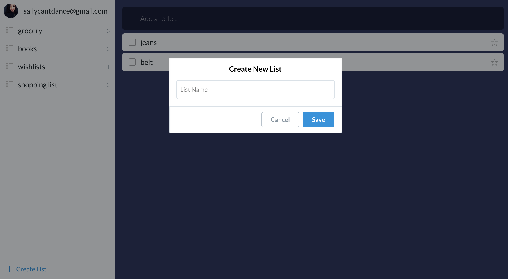

# Project 1: Wunderlist Clone

## Demo: [https://youtu.be/Lw_b6m5H9Jk](https://youtu.be/Lw_b6m5H9Jk)

## Project setup

- Installation: `yarn install`
- Compiles and hot-reloads for development: `yarn run serve`
- Compiles and minifies for production: `yarn run build`
- Run your unit tests: `yarn run test:unit`
- Lints and fixes files: `yarn run lint`

## What I've used and learned in this project

- directives, components, props, computed, methods, attributes
- slots, events, filters, toggle
- vue-cli
- vue-router
- Vuex or similar storage option
- transition & transition-group
- vue test-utils and mocha-webpack for unit testing
- rendering and re-rendering when data changed
